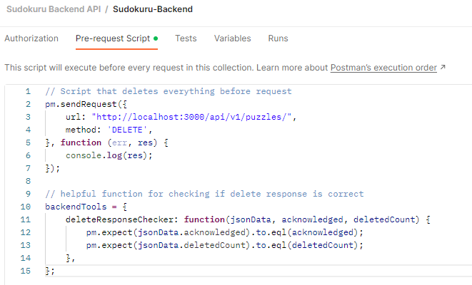
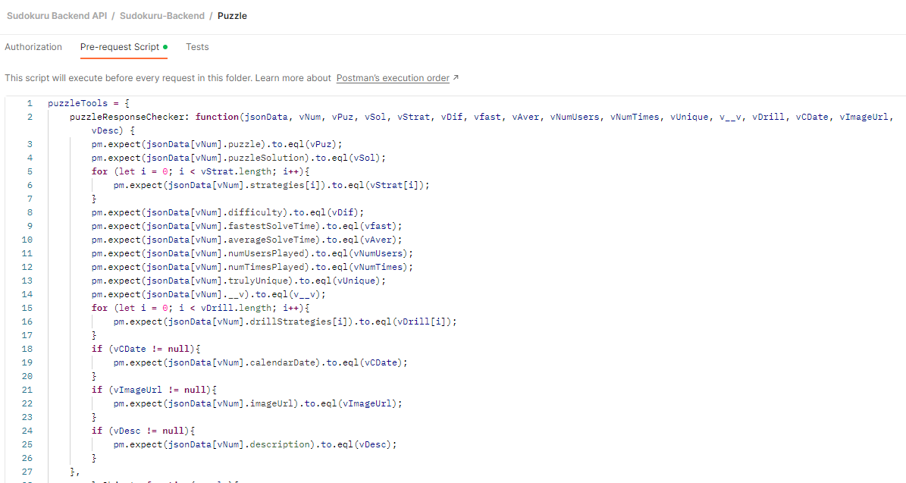
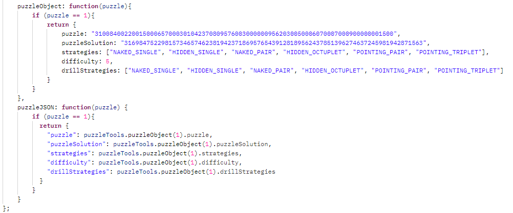
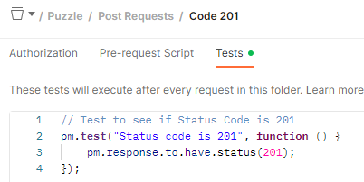

# [Typedoc Documentation Website](https://sudokuru.github.io/Backend/)<br>

# Todo

- [ ] Add license file and distribute to all repos using GitHub Action (Thomas)
- [ ] Finish writing integration tests for puzzle endpoint (Thomas)
- [ ] Write GitHub hook to run all tests before Push to repo (Thomas)
- [x] Set up Dev and Prod Lambda environments (Thomas/Gregory)
- [ ] Add Mermaid documentation and distribute to all repos using GitHub Action (Thomas)
- [ ] Clean up docker implementation (auto-rebuild) (Thomas)
- [ ] Decide on initial JSON structure for remaining endpoints (Team)
- [ ] Write logic for remaining endpoints (Daniel)
- [ ] Write sanitation and validation for remaining endpoints (Daniel)
- [ ] Write Postman integration tests for remaining endpoints (Daniel)
- [ ] Set up Auth0 token authentication (Thomas/Daniel)
- [ ] Write up OpenAPI specifications for endpoints (Thomas/Daniel)
- [ ] Resolve remaining ```//todo``` items (Thomas/Daniel)
- [ ] Determine how to set Prod environment to use versioning control (Thomas/Gregory)
- [ ] Implement unit tests if needed (Thomas/Daniel)

# Developer Setup

1. Install Docker on your machine. Tutorial is linked below:<br>
   [](https://www.youtube.com/watch?v=2ezNqqaSjq8)<br>
2. Once docker is installed, the Mongo image can be run by navigating to the backend folder and 
running the command<br>
```console
npm run database
```
3. The app can then be run with the command:<br>
```console
npm run start
```
4. Integration tests can be run when the app is running with this command:<br>
```console
npm run test:integration
```

# Postman

We are using Postman for integration tests.<br>
The following video is very helpful for understanding how Postman works with GitHub:<br>
[](https://www.youtube.com/watch?v=cB7mCuYeuAU)<br>

### Below is an example structure for tests based on Puzzle endpoint
The Postman tests are structured based on the endpoint name, the type of request, and the expected response code<br>

<br>

This structure allows us to write test cases for the Code 400 folder which would be run for all tests in that folder.<br>
<br>
All tests for the Sudokuru-Backend have access to the Sudokuru-Backend Pre-request scripts and tests.<br>
We currently have a Pre-request script that deletes the whole database before every test.<br>
We also have a function that can be used for all DELETE requests to validate the response.<br>

<br>

#### Inside the Puzzle endpoint folder we have shared functions to validate a puzzle response and to generate shared puzzle JSON for Pre-Request scripts for other tests.<br>

<br>
#### The below functions take in an integer and return either valid JSON or an object for reference.<br>
<br>

#### Inside the "Code 201" folder we have a test case that will be run for all tests inside of the folder.<br>
<br>